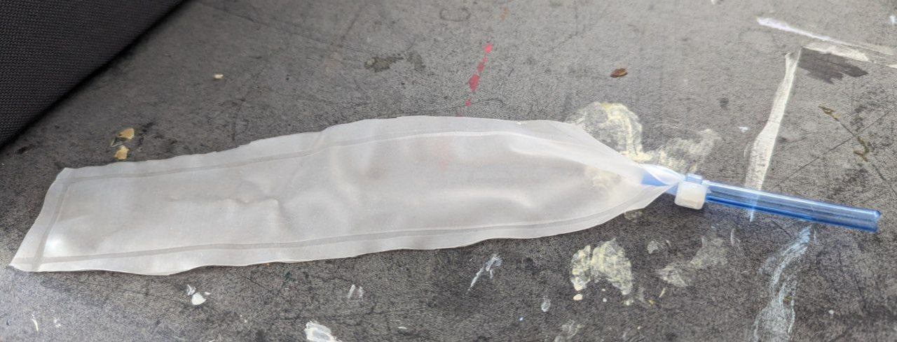

# Pneumatic actuators
The textile-based pneumatic actuators are based on the work in [this paper](https://www.liebertpub.com/doi/abs/10.1089/soro.2017.0076).

## Preparing the textile pocket
**The telepuppetry kit includes two ready-made textile pockets. If you would like to make one yourself, follow these steps:**

### Elastic layer
1. Cut a piece of knit, elastic fabric, about `100mm` in width and `540mm` in height.
2. Use the gathering technique described in [this video](https://www.youtube.com/watch?v=tO3ghcocAOU) to make equal folds into the fabric at a 3:1 ratio. The resulting fabric should be `100mm x 180mm`.

### Sewing the pocket
1. Cut a piece of woven, non-stretch fabric sized `100mm x 180mm`
2. Sew the two pieces together to create a pocket of `20mm x 180mm`. Use an overlocking machine or a standard machine using a low-distance zigzag stich. Sew in 3 sides, leaving one side open for inserting the balloon into the pocket.

The final result looks like this:

## Preparing the balloon

1. Cut two pieces of TPE, about `100mm x 300mm`.
2. Fuse the two pieces using the heat sealer according to the following diagram:

- Turn the heat sealer dial to number `6`.
- When sealing, apply pressure with your body onto the TPE for about `4 seconds`.

3. Cut an opening for the tube as shown in the diagram.

4. Insert a 6mm outer-diameter tube into the opening. Wrap the material of the 20mm tip around the tube and tighten it with a ziptie.

5. Cut close to the edges of the seal to make the balloon as small as possible.

The result should look like this:

## Testing the balloon

1. Connect the 10mm->2 x 6mm adapter to the compressor tube. 

2. Connect one solenoid valve to one 6mm outlet, so all air goes to the second outlet.

3. Connect the other outlet to the balloon.

4. Turn the compressor dial all the way anti-clockwise.

5. Turn on the compresor.

6. Slowly turn the dial clockwise to inflate the balloon. It should inflate to a considerable size (about 5 times in volume) without leaking or exploding.

## Inserting the balooon.

Use any long and thin, non-sharp tool to push the baloon into the pocket. Make sure it goes all the way in.

## Testing the actuator.

Use the baloon-testing method described above to test the actutaor, while tightly holding the open end of the pocket so that the balloon cannot escape from that end **Keep it tight! If the balloon escapes, it might explode**.

The actuator should curve nicely without leaking or exploding.

## Sealing the actuator
Use manual sewing to sew the remaining opening of the actuator. **Be careful not to puncture the balloon!**
