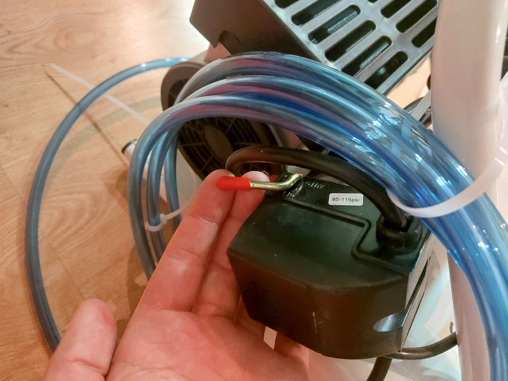
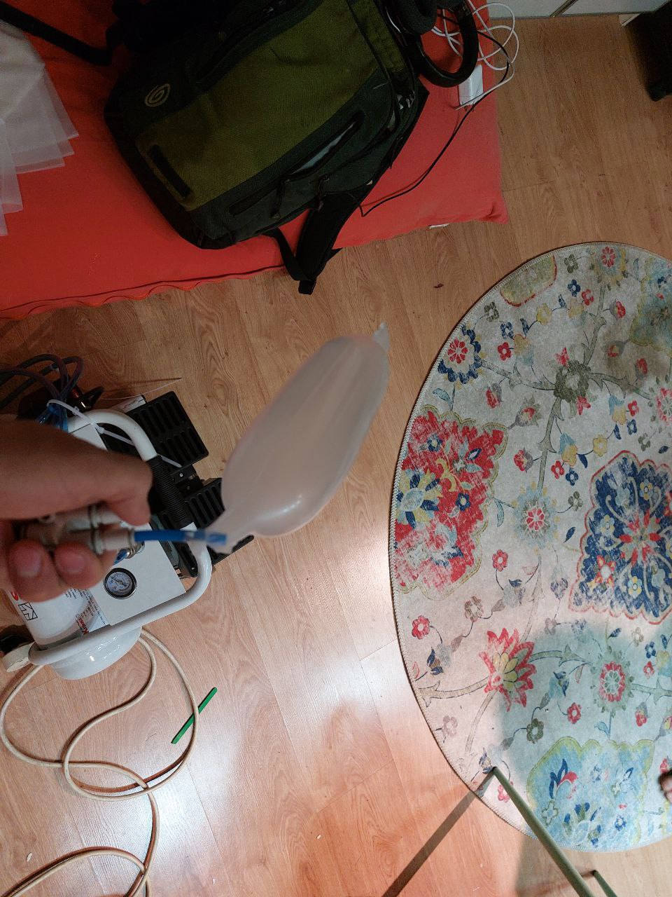

# Pneumatic actuators
The textile-based pneumatic actuators are based on the work in [this paper](https://www.liebertpub.com/doi/abs/10.1089/soro.2017.0076).

## Preparing the textile pocket
**The telepuppetry kit includes two ready-made textile pockets. If you would like to make one yourself, follow these steps:**

### Elastic layer
1. Cut a piece of knit, elastic fabric, about `100mm` in width and `540mm` in height.
2. Use the gathering technique described in [this video](https://www.youtube.com/watch?v=tO3ghcocAOU) to make equal folds into the fabric at a 3:1 ratio. The resulting fabric should be `100mm x 180mm`.

### Sewing the pocket
1. Cut a piece of woven, non-stretch fabric sized `100mm x 180mm`
2. Sew the two pieces together to create a pocket of `20mm x 180mm`. Use an overlocking machine or a standard machine using a low-distance zigzag stich. Sew in 3 sides, leaving one side open for inserting the balloon into the pocket.

The final result looks like this:

## Preparing the balloon

1. Cut two pieces of TPE, about `100mm x 300mm`.

2. You will need to fuse these pieces using the sealer. Set the sealer dial to number 6

Sealing should be done according to this diagram:

Should be somthing like that in the end:

3. Cut an opening for the tube and the edges of the balloon.

4. Insert a 6mm outer-diameter tube into the opening. Wrap the material of the 20mm tip around the tube and tighten it with a ziptie.

## Testing the balloon

You can firstly test the balloon by blowing it up with your lungs. Make sure it's not leaking air noticeably.

If it works, try testing it with compressor. Here is how it looks:

Make sure its release pipe is closed (valve handle should be perpendicular to the pipe)

There's a black knob in the center of the compressor that controls the output pressure.

Make sure it is rotated counter-clockwise maximally so we don't blow up the balloon.

Make sure a coupler like that (10mm to 2x6mm) is at the end of the compressor pipe:

If it's not take one from your kit and attach to it.

Turn on compressor with a red lever on a side:

Cover one of the outputs with your finger and connect a pipe to the other output.

Now you can slowly rotate black knob on compressor clockwise to add a bit of pressure.

Be careful not to blow up the balloon ;)

If it's not leaking, you're good!

## Inserting the balooon.

Use any long and thin, non-sharp tool to push the baloon into the pocket. Make sure it goes all the way in.

## Testing the actuator.

Use the baloon-testing method described above to test the actutaor, while tightly holding the open end of the pocket so that the balloon cannot escape from that end **Keep it tight! If the balloon escapes, it might explode**.

The actuator should curve nicely without leaking or exploding.

## Sealing the actuator
Use manual sewing to sew the remaining opening of the actuator. **Be careful not to puncture the balloon!**
