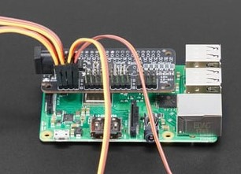

# Pneumatics Panel
## Assembly

### Raspberry Pi
The Raspberry Pi is the central controller of the telepuppet. 
1. Screw the raspberry pi to the _Rpi mount_ component. 
_If there is a screw shortage you can use only two screws out of the four holes available._ 
2. Connect the _Servo Bonnet_ to the raspbery pi on the  as shown in this image:



**Make sure the bonnet header is alligned correctly with the pins (no pins should remain outside of the bonnet header)**

3. Connect the _pressue sensing hat_ the servo bonnet.

    **Note: In some cases, the servo motor connectors push the hat out, causing the pins to disengage. In these cases, it helps to connect some servo motors in the left side of the bonnet and some in the right side of the bonnet.**

4. Connect the _dc motor bonnet_ to the _pressure sensing hat_ as shown in this image:


5. Mount the raspberry pi in the center of the panel.


### Solenoid valves
The solenoid valves control the incoming and outgoing air from an actuator. They can be either fully open or fully closed.

1. Valve connectors screw into the valve. Before screwing a connector, wrap the threads for 2-3 layers of Teflon tape.
2. Inlet valve require two connectors, outlet valves just one.

3. Mount the solenoid valves to their apprproriate location on the panel.

4. Plug the solenoid valve's cables into the dc motor bonnet's screw terminals (M1, M2, etc. Ground terminal can remain empty).


### Servo valves
The servo valve regulates the flow of air entering the actuator proportionally. It is comprised of a manual ball valve and servo motor that moves the handle.

### Calibrating the servo valve
The ball valve is fully open when the handle is at a horizontal position and is fully closed the handle is at a vertical position.

The servo motor connects to the ball valve via a coupling adapter.

1. First, the servo horn should be calibrated so that it starts at the fully horizontal position, matching the ball valve's handle position.

2. Use the `connection_check_servo.py` script to move the servo motor between 0 and 80 degrees. The horn should be placed on the servo so that it is horizontal at `0` degrees, and rotates clockwise to a vertical position at `80` degrees.

### Assembling the servo valve
Once the servo is calibrated, the valve can be assembled.

1. Place the ball valve in its designated loation and close the lid with the M3 screw.

2. Make sure the ball valve is at the open horizontal position. Place the coupling adapter on the handle.

3. Mount the servo motor into the coupling adapter and secure it via the screws. **Do not screw the servo too tightly**

### Connecting the servo valve.

1. Connect the servo motors to the servo bonnet.

2. Mount the servo valves to their locations on the panel.

3. Use the `connection_check_servo.py` script to test the setup. 


### Cross adapters
Cross adapter split the incoming air flow to the actuator to three possible pathways:

1. The actuator itself.
2. A pressure sensor.
3. The outlet valve (to release the air).

Mount the cross adapters to their appropriate location on the panel.

## Tubing.

The air arrives from the compressor and is split to two actuators via the 10mm->6mm adapter.

Some connectors use a `Push-in` type. Simply push the tube into the port until the edge pops out the tube is locked. To release the tube, press the edge of the connector and then pull the tube out.

Other connetors (barbed plastic) fit inside the tube.

The tubing path is as follows:

1. A 6mm (outer diameter) tube from the adapter goes to an inlet valve.
2. A 6mm tube goes from the inlet valve to the servo valve.
3. A 6mm tube goes from the servo valve to the cross connetor.
4. A 6mm tube goes from the cross connector to the inlet valve.
5. A 6mm gube goes from the the cross conector to the actuator. Use a linear extender to bring the actuator further away from the cross connector.
6. A 6mm tube goes into a liner extender, which goes into a 3mm tube that goes into one pressure sensor.


## Test
The following scripts tests that all components are functional.

**Do not run the script when air flow is connected**

```
$ cd puppetbots/prototype
```
```
$ python3 util/connection_check.py
```


