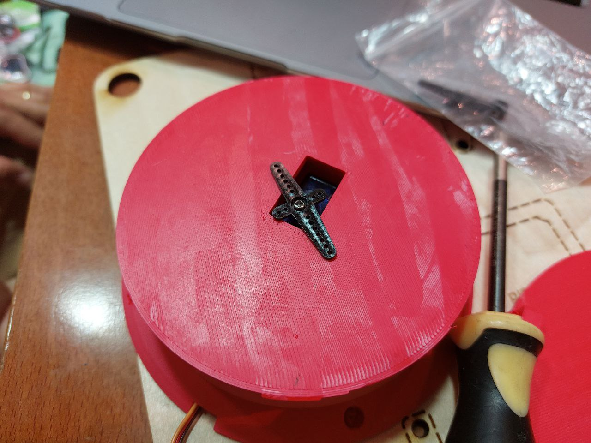
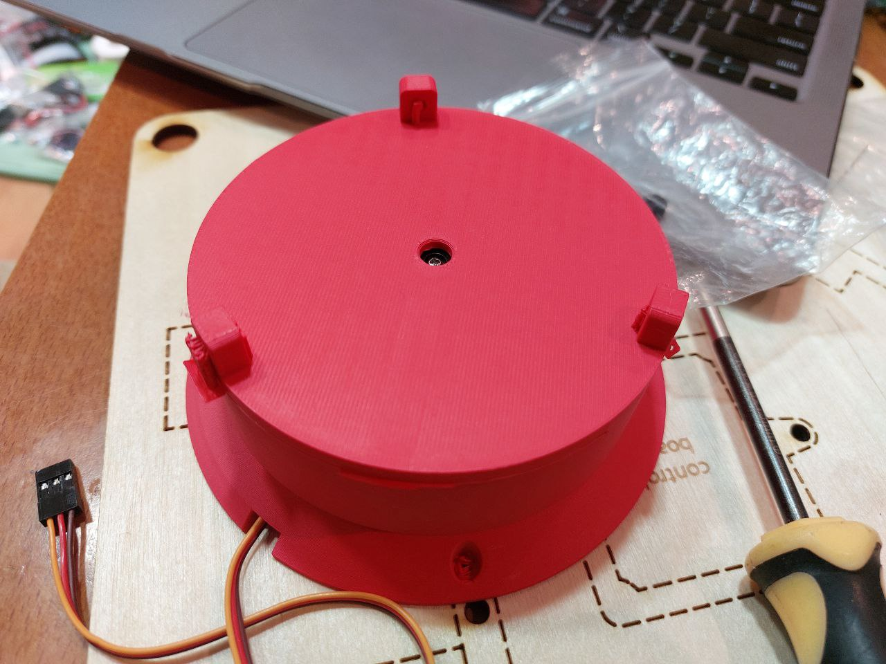
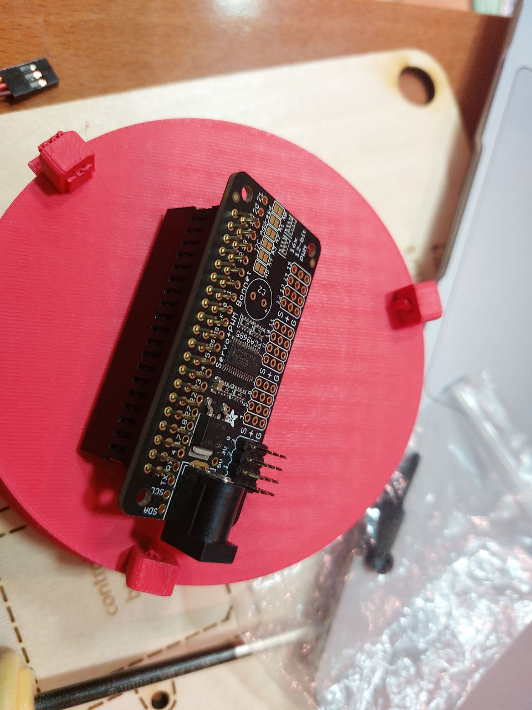
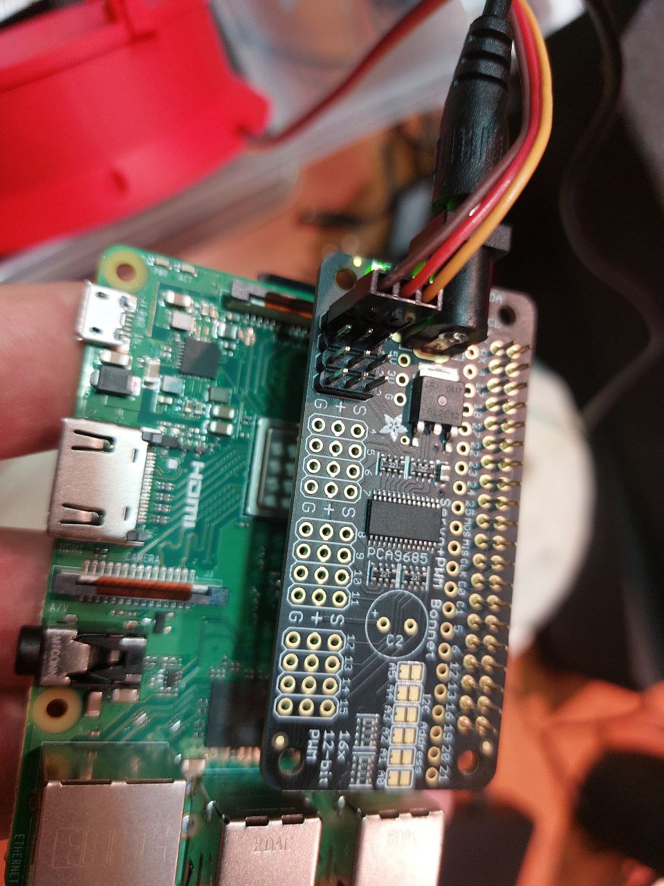

# Rotating Plate
## Assembly
These are the pieces that you need on this stage:
- flat rotating panel
- cylindrical base of rotating panel
- SG92R servo motor
Follow these steps:
1. Screw SG92R to the base like on the photo below:


2. In the same pocket where was SG92R there's a plastic horn that needs to be screwed to the servo

4. The flat rotating panel can be added on top of the base like that:

5. Find the Servo+PI Bonnet in the kit, it looks like that:

6. Connect the bonnet on top of the PI. Connect the servo to it:


The plate is operated by an SG92R servo motor and is located outisde of the [wooden pneumatic panel](pneumatics-panel.md).
1. Screw the servo into the base of the plate using the provided mounting screws.
2. Attach the 'plus-shaped' horn to the servo, screw the horn using the provided small horn screw.
3. Connect the _Servo Bonnet_ to the raspbery pi on the [pneumatic panel](pneumatics-panel.md) as shown in this image:


**Make sure the bonnet header is alligned correctly with the pins (no pins should remain outside of the bonnet header)**

4. Connect the **6V power adapter** to the servo bonnet.

**NOTICE: The kit includes both a 6V power adapter and a 12V one. Do not use the 12V power adapter with the servo bonnet.**  

4. Connect the SG92R motor to the bonnet. The dark (brown or black) wire should be on the side that says **G**.
5. Mount the plate on the horns.
6. Mount the puppet's body onto the plate. The body consists of a bottle that is tightened with screws.

## Test
The plate can be tested via the following script:

```
$ cd puppetbots/prototype
```
```
$ python3 util/connection_check_servo.py
```


## Usage
The oritentation of the puppet can be detected from the hand position either via _MediaPipe Vision AI_ or _Rokoko Smart Gloves_. The value is processed in the [Touch Designer controller](touch-designer.md).

### Mediapipe 
Orientation value is picked up as an angle between `0` and `180` on the node `orientation_value_ai`.

When a substantial change is detected via the `orientation_value_ai_slope` node, the `orientation_trigger_ai` is triggered and executes `orientation_ai_script`. The value is sent to the [Rust server](rust-server.md) via the `'O'` socket command. 

### Smartgloves 
Orientation value is picked up as an angle between `0` and `180` on the node `orientation_value_glove`.

Depending on whether you are using the right or left hand, connect either the `left_hand_orientation` or `right_hand_orientation` node to the `orientation_glove_filter` node.

When a substantial change is detected via the `orientation_value_glove_slope` node, the `orientation_trigger_glove` is triggered and executes `orientation_glove_script`. The value is sent to the [Rust server](rust-server.md) via the `'O'` socket command. 